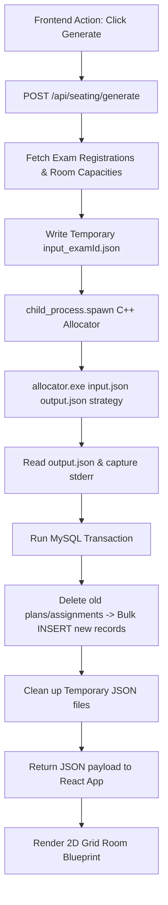
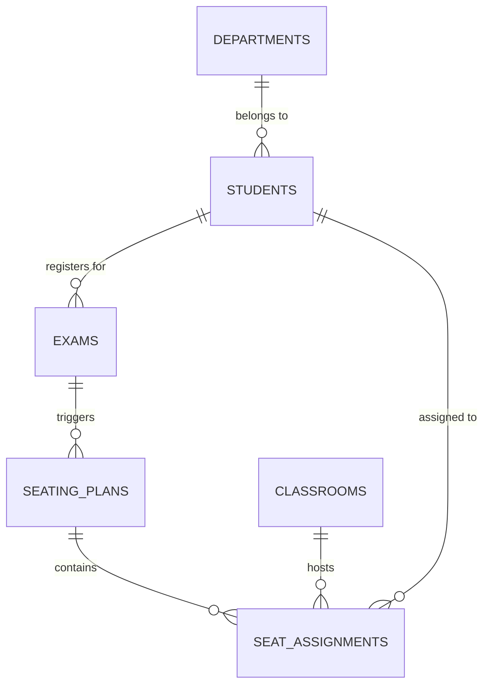

# Intelligent Exam Seating Arrangement System

An optimized, full-stack application designed to automate and manage candidate seating layout plans for university examinations. The core layout computation is offloaded to a high-speed, constraint-based C++ engine, with a Node.js/Express middleware layer, a relational MySQL persistence store, and a beautiful React.js single-page application dashboard.

---

## 🚀 Key Features

* **Live Analytics Dashboard**: Consolidated statistics showing total candidates, classroom sizes, scheduled assessments, room capacity utilization rates, and detailed allocation engine metrics (execution times, proximity conflicts).
* **Interactive 2D Spatial Layout Grid**: True-to-life visualization of classroom desk grids (Rows × Columns) color-coded by student departments, displaying empty desks, inspected tooltips, and scale zoom controls.
* **Full CRUD Management**: Fully validated interfaces for registering students (including bulk CSV uploads with name parsing), creating exam sessions, and configuring classroom capacities.
* **Intelligent Optimization Algorithm**: CLI integration with a high-performance C++ executable running constraint-solving optimization models.
* **Data Portability & Reports**: Export complete seating arrangements as raw CSV tables, serialized JSON logs, or generate printer-friendly physical seating charts.

---

## 🛠 Tech Stack

* **Frontend**: React.js, TypeScript, Vite, Tailwind CSS, Lucide icons
* **Backend**: Node.js, Express.js, MySQL, Multer (multipart imports)
* **Allocation Engine**: C++ executable (`allocator.exe`) running local processes

---

## 📂 Project Architecture

```
├── frontend/                     # React Single Page Application
│   ├── src/
│   │   ├── components/           # Common layouts, Table, Card, Page Header
│   │   ├── pages/                # Dashboard, Students, Classrooms, Exams, SeatingPlan
│   │   ├── services/             # Axios API clients (seating, students, classrooms, exams)
│   │   └── types/                # TypeScript interface mappings
│   └── package.json
│
├── backend/                      # Node.js REST API Server
│   ├── src/
│   │   ├── controllers/          # Request handlers & logic pipelines
│   │   ├── routes/               # Express endpoint definitions
│   │   ├── services/             # C++ child_process exec & MySQL transaction handlers
│   │   └── config/               # Database pool connectivity configuration
│   ├── database/
│   │   ├── schema.sql            # Table structures, constraints & relationships
│   │   └── sample_data.sql       # Mock records for immediate sandbox testing
│   ├── server.js                 # App server registration and initialization
│   └── package.json
│
└── cpp-engine/                   # Constraint Solver Engine
    ├── src/                      # Source files
    └── allocator.exe             # High-speed executable binaries
```

---

## 🔄 Allocation Execution Pipeline



---

## 💾 Relational Database Schema

The database utilizes relational integrity constraints (`ON DELETE CASCADE`) to synchronize seating plans:



### Table Schema Definitions
1. **`departments`**: Code and name definitions of academic divisions.
2. **`students`**: Personal details, roll numbers, sections, and semesters.
3. **`classrooms`**: Venue records containing coordinate layouts (Rows × Columns) and maximum seat capacities.
4. **`exams`**: Academic schedules, subject codes, dates, times, and computed durations.
5. **`seating_plans`**: Parent plan logs summarizing allocator statistics (e.g. `total_students`, `occupied_seats`, `conflict_count`, `execution_time_ms`).
6. **`seat_assignments`**: Direct junction table binding a student to a room row-column coordinate seat. Includes a unique key constraint on `(plan_id, student_id)` and `(plan_id, classroom_id, row_no, col_no)` to prevent overlapping seats.

---

## 🌐 API Specifications

### 📊 Dashboard
* `GET /api/dashboard/stats`: Aggregates records, capacity utilization, and latest seating plans metrics.

### 🎓 Students
* `GET /api/students`: Lists all active student directory records.
* `POST /api/students`: Registers a new student.
* `PUT /api/students/:id`: Updates student details.
* `DELETE /api/students/:id`: Removes student profile.
* `POST /api/students/upload`: Parses raw student lists from CSV formats.

### 🏫 Classrooms
* `GET /api/classrooms`: Lists configured halls.
* `POST /api/classrooms`: Adds new classrooms layout.
* `PUT /api/classrooms/:id`: Modifies classroom dimensions.
* `DELETE /api/classrooms/:id`: Removes classroom.

### 📅 Exams
* `GET /api/exams`: Lists scheduling cards.
* `POST /api/exams`: Registers assessment timetables.
* `PUT /api/exams/:id`: Modifies scheduling card details.
* `DELETE /api/exams/:id`: Deletes exam schedule.

### 💺 Seating
* `POST /api/seating/generate`: Triggers C++ allocator for an exam, writing results inside database transactions.
* `GET /api/seating/:examId`: Retrieves the current seating layout plan.

---

## ⚙️ Setup and Installation

### 1. Database Configuration
1. Initialize a MySQL server instance.
2. Run database structure scripts:
   ```bash
   mysql -u [user] -p[password] < backend/database/schema.sql
   mysql -u [user] -p[password] < backend/database/sample_data.sql
   ```
3. Create `backend/.env` file and supply connection variables:
   ```env
   DB_HOST=localhost
   DB_USER=root
   DB_PASSWORD=your_password
   DB_NAME=exam_seating_db
   PORT=5000
   ```

### 2. Run Backend Server
```bash
cd backend
npm install
npm start
```

### 3. Run Frontend Application
```bash
cd frontend
npm install
npm run dev
```
Open [http://localhost:5173](http://localhost:5173) in your browser.

---

## 🧪 E2E Verification
You can run automated test scripts to verify the C++ child process execution and MySQL integrations:
```bash
cd backend
npm test
```
The test suite validates mock JSON generation, exit codes execution, database transactions rollback logic, and schema constraints.
